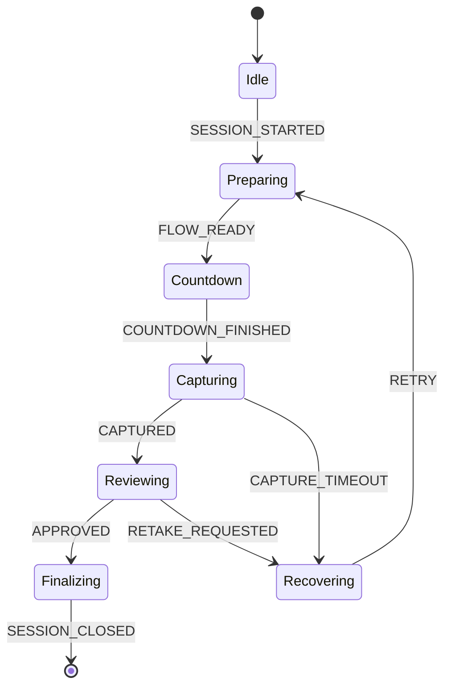

# Renderer 중심 아키텍처 개요

이 문서는 Electron 기반 키오스크 앱의 렌더러(React)가 어떤 책임을 가지며, 어떤 구조와 원칙으로 설계되었는지를 설명합니다. 실행 가능한 앱 설명이 아닌 설계 사고를 다루며, Main/Preload는 경계 역할만 언급합니다.

## 1. 설계 목표
- **운영 환경 적합성**: 네트워크 품질이 일정하지 않고, 디스플레이·입력 장치만 존재하는 제한된 환경에서도 안정적으로 동작하도록 렌더러만으로도 핵심 UX를 유지합니다.
- **장애 내성**: 하드웨어·IPC 이벤트 지연에 대응해 타임아웃, 재시도, 대체 경로를 UI 상태로 표현합니다. 렌더러는 항상 "안전한 다음 단계"를 안내하는 것을 우선합니다.
- **확장성**: 기능 추가 시 영향을 최소화하기 위해 책임을 레이어별로 고정하고, 상태 머신/이벤트 계약을 명시적으로 관리합니다. Pages/Features/Widgets가 독립적으로 교체 가능해야 합니다.

## 2. Renderer 레이어 구조
Renderer는 시각적 깊이와 의존 방향을 기준으로 네 개의 레이어를 가집니다.

- **Pages**
  - 라우팅 단위. 세션 흐름의 주요 화면(예: 대기, 촬영, 확인, 결제)을 표현합니다.
  - Feature 조합과 상태 구독을 담당하며, 상태 변경을 오케스트레이션합니다.
- **Features**
  - 특정 사용자 여정(예: 촬영 시퀀스, 결제 플로우)을 캡슐화합니다.
  - 상태 머신, IPC 호출, 비즈니스 규칙을 포함하고, Page와 Widget을 조립합니다.
- **Widgets**
  - 반복 사용되는 UI 컴포넌트(타이머, 상태 배지, 재시도 버튼 등). 상태는 상위에서 주입받으며, 하드웨어/IPC에 직접 접근하지 않습니다.
- **shared**
  - 유틸리티, 타입, 테마, IPC 계약 정의 등이 위치합니다. 상향 의존만 허용하여 순환을 방지합니다.

레이어 간 원칙
- Widgets → Features → Pages 방향으로만 데이터 흐름을 허용합니다.
- shared는 어느 레이어에서도 참조할 수 있지만, shared는 하위 레이어를 참조하지 않습니다.
- IPC 호출은 Feature에서만 수행하며, Page/Widget은 명시된 이벤트와 상태만을 다룹니다.

## 3. 상태 흐름과 오케스트레이션
렌더러는 메모리 상의 상태 머신으로 세션을 조립하고, IPC 이벤트를 통해 외부 결과를 반영합니다.

- **세션 관리**
  - 세션 ID, 타임아웃, 진행 단계(대기 → 안내 → 촬영 → 검수 → 출력/전송)를 단일 스토어에서 관리합니다.
  - Preload는 세션 시작·종료·갱신 IPC를 한정된 헬퍼로 노출하고, Main은 세션 수명을 보장하는 신호만 보냅니다.
- **촬영 시퀀스**
  - Feature 내부 상태 머신 예: `Idle → Preparing → Countdown → Capturing → Reviewing → Finalizing`.
  - Countdown·Capturing 단계에서 실패 시 `Recovering`으로 전환해 UI가 재시도를 제안하거나 초기화 버튼을 노출합니다.
- **오케스트레이션 방식**
  - Feature는 상태 머신과 이펙트 레이어(IPC 호출, 타이머, 키오스크 입력 이벤트)를 분리합니다.
  - Page는 Feature의 상태를 구독하고, 필요한 Widget(타이머, 진행 상태 표시)을 배치합니다.
  - 상태 전환은 명시적 이벤트(예: `SESSION_STARTED`, `CAPTURE_CONFIRMED`)로만 발생하며, 직접 상태 변경을 금지합니다.

## 4. 실패/복구를 고려한 UI 설계
- **명시적 실패 상태**: 로딩/진행 상태와 별도로 `Recovering`과 같은 실패 전용 상태를 두어, UI가 재시도·건너뛰기·초기화 선택지를 제공하도록 합니다.
- **타임아웃 우선 전략**: IPC 응답 지연 시 화면이 정지해 보이지 않도록 타이머·스켈레톤 UI·가이드 텍스트를 표시하고, 자동 재시도까지 남은 시간을 안내합니다.
- **사용자 주도 복구**: 모든 주요 단계에 수동 재시도/세션 초기화 버튼을 배치합니다. 단, 오작동 방지를 위해 Feature가 상태 전이 가능 여부를 검증한 뒤 위임합니다.
- **진행 보전**: 실패 후에도 이미 확보한 데이터(사진 썸네일, 사용자 선택 옵션)는 세션 스토어에 유지하여, 복구 후 동일 화면에서 이어갈 수 있도록 합니다.

## 5. Main/Preload 경계 요약
- Preload는 렌더러가 사용할 IPC 채널과 타입만 노출하며, 상태 머신이 요구하는 신호만 전달합니다.
- Main은 창/프로세스 수명과 하드웨어 추상화만 담당하고, 렌더러 UI 규칙이나 상태를 직접 변경하지 않습니다.
- 렌더러는 하드웨어 세부 사항을 알지 못하고, 실패·성공 여부만 계약된 이벤트로 판단합니다.
